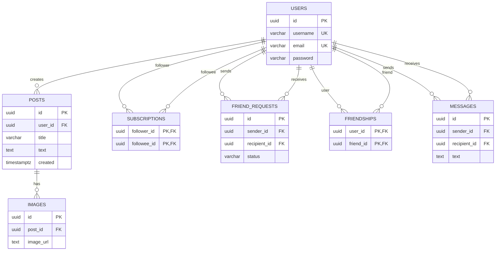

# Доменная модель Social Media

## Требования по заданию

### 1. Аутентификация и авторизация

- Пользователи могут зарегистрироваться, указав имя пользователя, электронную почту и пароль.
- Пользователи могут войти в систему, предоставив правильные учетные данные.
- API должен обеспечивать защиту конфиденциальности пользовательских данных, включая хэширование паролей и использование JWT.

### 2. Управление постами

- Пользователи могут создавать новые посты, указывая текст, заголовок и прикрепляя изображения.
- Пользователи могут просматривать посты других пользователей.
- Пользователи могут обновлять и удалять свои собственные посты.

### 3. Взаимодействие пользователей

- Пользователи могут отправлять заявки в друзья другим пользователям. С этого момента, пользователь, отправивший заявку, остается подписчиком до тех пор, пока сам не откажется от подписки.
- Если пользователь, получивший заявку, принимает ее, оба пользователя становятся друзьями.
- Если пользователь, получивший заявку, отклонит ее, пользователь, отправивший заявку, все равно остается подписчиком.
- Пользователи, являющиеся друзьями, также являются подписчиками друг на друга.
- Если один из друзей удаляет другого из друзей, то он также отписывается. Второй пользователь при этом должен остаться подписчиком.
- Друзья могут писать друг другу сообщения.

### 4. Подписки и лента активности

- Лента активности пользователя должна отображать последние посты от пользователей, на которых он подписан.
- Лента активности должна поддерживать пагинацию и сортировку по времени создания постов.
